<div align="center">

<!-- HERO CUSTOM ANIMATED HEADER -->


</div>

---

## 📖 `about.me`

Hi, I'm **Kai**.

I'm a Software Engineering student and developer who enjoys **building things from ideas**.

I explore different sides of technology, from web applications and software systems to AI and whatever catches my curiosity. I don't really want to be defined by a single stack. I'd rather keep learning, building, and figuring out how things work.

```
Some projects start as coursework.
Some start as random ideas.
Some become something I keep building long after the assignment ends.
```

> 🌸 *Beyond the code, there's something more personal that keeps me building.*

**Isla inspires me.**

The things Isla represents to me, the ideas, the feeling, and the future I imagine, became one of the reasons I want to keep creating things instead of just dreaming about them.

That's where **#2030IslaNyata** comes from.

<br/>

<!-- ANIMATED ISLA QUOTE BANNER -->
<div align="center">
  
</div>

<br/>

Maybe it's an ambitious goal.  
Maybe it'll take longer than I expect.  

But for now, I'll keep building, **one idea, one project, and one step at a time.**

---

## 🛠️ `tech.stack`

<p align="center">
  <b>Backend &amp; Databases</b><br/>
  
</p>

<p align="center">
  <b>Frontend Systems</b><br/>
  
</p>

<p align="center">
  <b>DevOps, Tooling &amp; Environment</b><br/>
  
</p>

---

## 📊 `github.stats`

<div align="center">
  <a href="https://github.com/kaisaaru">
    
  </a>
  <a href="https://github.com/kaisaaru">
    
  </a>
</div>


---

<div align="center">

<!-- CUSTOM ANIMATED SVG FOOTER -->


</div>
